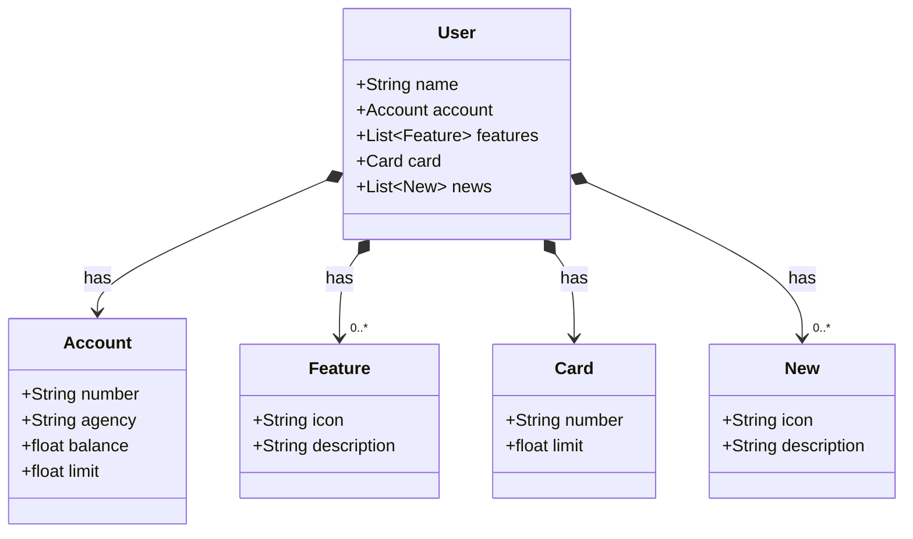

# Santander Dev Week
Java RESTful API criando para a Santander Dev Week.

## Diagrama de classes 

```mermaid
classDiagram
    class User {
        +String name
        +Account account
        +List~Feature~ features
        +Card card
        +List~New~ news
    }

    class Account {
        +String number
        +String agency
        +float balance
        +float limit
    }

    class Feature {
        +String icon
        +String description
    }

    class Card {
        +String number
        +float limit
    }

    class New {
        +String icon
        +String description
    }

    User *--> Account : has
    User *--> "0..*" Feature : has
    User *--> Card : has
    User *--> "0..*" New : has
```
